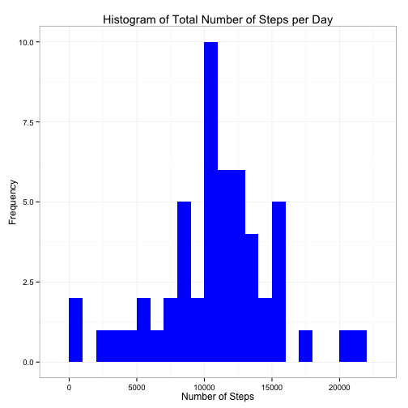
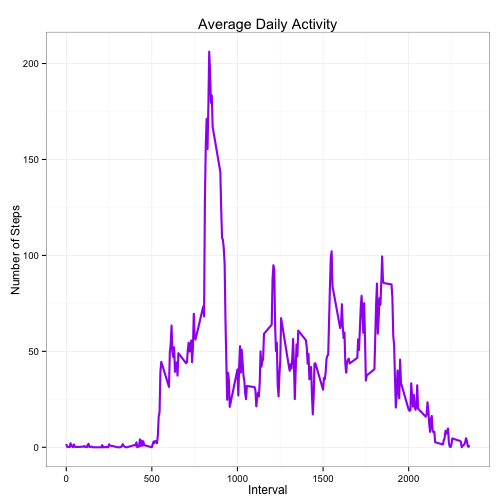
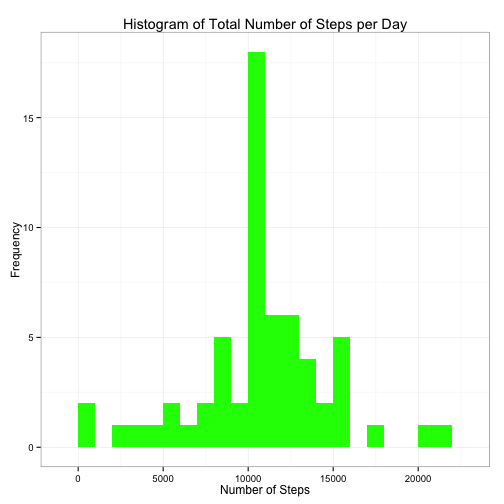
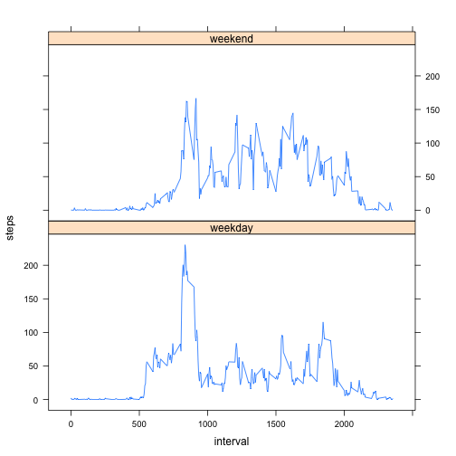

Reproducible Research Project 1
===============================

### Introduction

This project makes use of data from a personal activity monitoring device that collects the number of steps taken throughout the day. The data consists of two months of data from an anonymous individual collected during the months of October and November, 2012 and includes the number of steps taken in 5-minute intervals each day.

The dataset used can be downloaded here: [Activity monitoring data](https://d396qusza40orc.cloudfront.net/repdata%2Fdata%2Factivity.zip) [52K]

### Loading and preprocessing the data

##### Load required libraries.


```r
library(ggplot2)
library(lattice)
```

##### 1. Load the data.


```r
if(!file.exists("activity.csv")) {
    temp <- tempfile()
    download.file("https://d396qusza40orc.cloudfront.net/repdata%2Fdata%2Factivity.zip", temp)
    file <- unzip(temp)
    unlink(temp)
} 

activity <- read.csv("activity.csv", colClasses=c("numeric", "character", "numeric"))
```

##### 2. Process/transform the data into a format suitable for analysis.


```r
activity$date <- as.Date(activity$date, format="%Y-%m-%d")
str(activity)
```

```
## 'data.frame':	17568 obs. of  3 variables:
##  $ steps   : num  NA NA NA NA NA NA NA NA NA NA ...
##  $ date    : Date, format: "2012-10-01" "2012-10-01" ...
##  $ interval: num  0 5 10 15 20 25 30 35 40 45 ...
```

### What is mean total number of steps taken per day?

Note: Missing values in the dataset are ignored for this part of the project.

##### 1. Make a histogram of the total number of steps taken each day.


```r
steps_day <- aggregate(steps ~ date, activity, sum)

ggplot(steps_day, aes(x=steps)) + 
    geom_histogram(fill="blue", binwidth=1000) + 
    labs(title="Histogram of Total Number of Steps per Day", 
         x="Number of Steps",
         y="Frequency") +
    theme_bw()
```

 

##### 2. Calculate and report the **mean** and the **median** total number of steps taken per day


```r
options(scipen=999) # remove scientific notation when printing
activity_mean <- mean(steps_day$steps, na.rm=TRUE)
activity_median <- median(steps_day$steps, na.rm=TRUE)
```

The mean of steps taken per day: **10766.19**.  
The median of steps taken per day: **10765**.   

### What is the average daily activity pattern?

##### 1. Make a time series plot of the 5-minute interval (x-axis) and the average number of steps taken, averaged across all days (y-axis).


```r
interval_avg <- aggregate(steps ~ interval, activity, mean)

ggplot(interval_avg, aes(x=interval, y=steps)) +
    geom_line(color="purple", size=1) + 
    labs(title="Average Daily Activity",
         x="Interval", 
         y="Number of Steps") +
    theme_bw()
```

 

##### 2. Which 5-minute interval, on the average across all the days in the dataset, contains the maximum number of steps?


```r
max_interval <- interval_avg[which.max(interval_avg$steps), ]
```

The maximum number of **206.17** steps occurs at interval **835**. 

### Impute missing values

There are a number of days/intervals where there are missing values (coded as `NA`). The presence of missing values may introduce bias into some calculations or summaries of the data.

##### 1. Calculate and report the total number of missing values in the dataset (i.e. the total number of rows with `NA`s)


```r
total_na <- sum(is.na(activity$steps))
```

There are **2304** rows with `NA`s.

##### 2. Devise a strategy for filling in all of the missing values in the dataset. 

**The mean value for the 5-minute interval is used to populate the missing values corresponding to the same interval in the dataset.**

##### 3. Create a new dataset that is equal to the original dataset but with missing data filled in.


```r
fill_data <- activity
for (i in 1:nrow(fill_data)) {
    if (is.na(fill_data[i, "steps"])) {
        interval <- fill_data[i, "interval"]
        fill_data[i, "steps"] <- interval_avg[interval_avg$interval==interval, ]$steps
    }
}

count_na <- sum(is.na(fill_data$steps))
```

After creating a new dataset filling in missing values, we see there are now **0** `NA`s.

##### 4. Make a histogram of the total number of steps taken each day.


```r
steps_day_fill <- aggregate(steps ~ date, fill_data, sum)

ggplot(steps_day_fill, aes(x=steps)) + 
    geom_histogram(fill="green", binwidth=1000) + 
    labs(title="Histogram of Total Number of Steps per Day", 
         x="Number of Steps",
         y="Frequency") +
    theme_bw()
```

 

##### Calculate and report the **mean** and **median** total number of steps taken per day. 


```r
fill_data_mean <- mean(steps_day_fill$steps)
fill_data_median <- median(steps_day_fill$steps)
```

The mean of steps taken per day: **10766.19**.  
The median of steps taken per day: **10766.19**.   

##### Do these values differ from the estimate from the first part of the project? 

- Original dataset 
    - Mean: **10766.19**  
    - Median: **10765**  
- Imputed dataset 
    - Mean: **10766.19**  
    - Median: **10766.19**  

##### What is the impact of imputing missing data on the estimates of the total daily number of steps?

**Comparing the calculations from the original and the imputed datasets, we observe the mean value is unchanged, while the median value increased sligthly to meet the mean value.**  

**In comparing the respective histograms, we see that imputing the missing values increases our peak values and decreases the values at the lower bounds. However, this doesn't negatively impact our predictitions.**

### Are there differences in activity patterns between weekdays and weekends?

Note: The dataset with the filled-in missing values for this part.

##### 1. Create a new factor variable in the dataset with two levels --- "weekday" and "weekend" indicating whether a given date is a weekday or a weekend day.


```r
fill_data$is_weekend <- weekdays(fill_data$date)

for (i in 1:nrow(fill_data)) {
    if (fill_data$is_weekend[i] == "Saturday" | fill_data$is_weekend[i] == "Sunday") {
        fill_data$is_weekend[i] <- "weekend"
    } else {
        fill_data$is_weekend[i] <- "weekday"
    }
}

fill_data$is_weekend <- factor(fill_data$is_weekend)
```

##### 2. Make a panel plot containing a time series plot of the 5-minute interval (x-axis) and the average number of steps taken, averaged across all weekday days or weekend days (y-axis). 


```r
fill_avg_interval <- aggregate(steps ~ interval + is_weekend, data=fill_data, mean)
xyplot(steps ~ interval | is_weekend, data=fill_avg_interval, type="l", layout=c(1,2))
```

 
